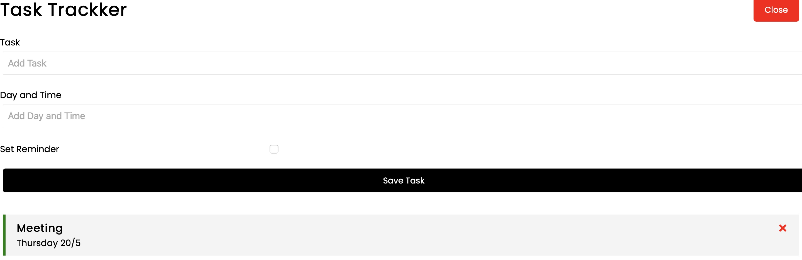

# Task Tracker Project Of React

This project is a simple application to of a task tracker.

## Open the Project

1. Download the Project
2. Turn on the terminal
3. Type the command

```bash
npm install
```

4. Type the command

```bash
npm start
```

---

## Content of the page


